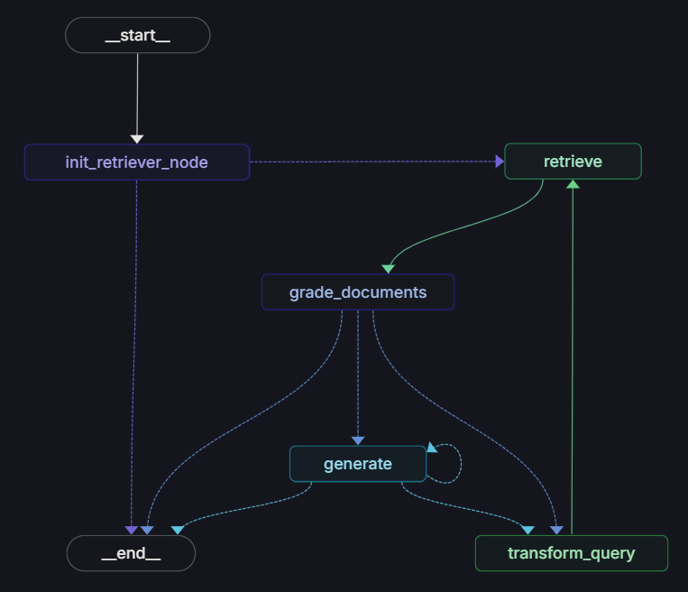

# RAG Playground

A collection of advanced Retrieval-Augmented Generation (RAG) implementations using LangGraph. This repository showcases different RAG architectures, each designed to handle various retrieval and generation scenarios.

## Implementations

### 1. Self-RAG

**Overview**: A Self-Reflective RAG system that enhances traditional RAG with self-assessment capabilities. It evaluates the quality of retrieved documents and generated responses, enabling iterative improvements.

**Key Features**:
- Self-assessment of document relevance
- Iterative response refinement
- Quality control for generated outputs

### 2. Corrective RAG (CRAG)

**Overview**: An enhanced RAG system that incorporates web search capabilities to handle out-of-distribution queries and correct potential inaccuracies in retrieved information.

**Key Features**:
- Web search fallback for unknown queries
- Automatic correction of retrieved information
- Dynamic query transformation

### 3. Agentic RAG

**Overview**: Combines LLM agents with RAG, enabling dynamic decision-making during the retrieval and generation process through an agent-based architecture.

**Key Features**:
- Autonomous decision-making for retrieval
- Dynamic tool usage
- Flexible response generation

### 4. Adaptive RAG

**Overview**: Intelligently routes queries based on complexity, choosing between direct generation and a more sophisticated RAG approach.

**Key Features**:
- Automatic query complexity assessment
- Dynamic routing between generation strategies
- Optimized performance for different query types

### 5. RAPTOR

**Overview**: Implements Recursive Abstractive Processing for Tree-Organized Retrieval, providing advanced document processing and hierarchical information retrieval.

**Key Features**:
- Hierarchical document clustering
- Multi-level summarization
- Efficient retrieval from large document collections

## License

This project is licensed under the MIT License - see the LICENSE file for details.